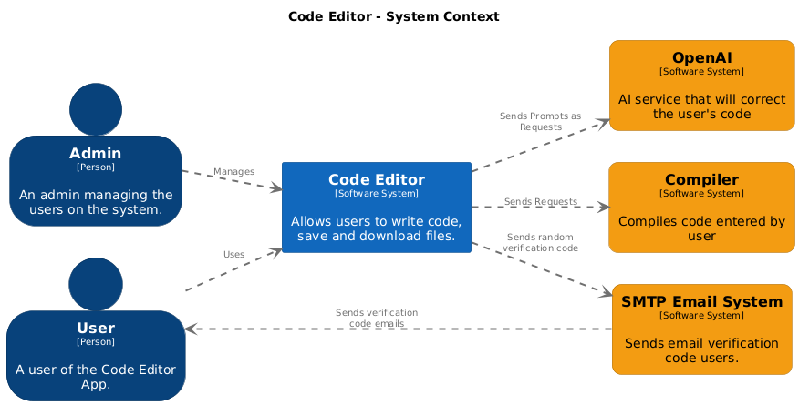
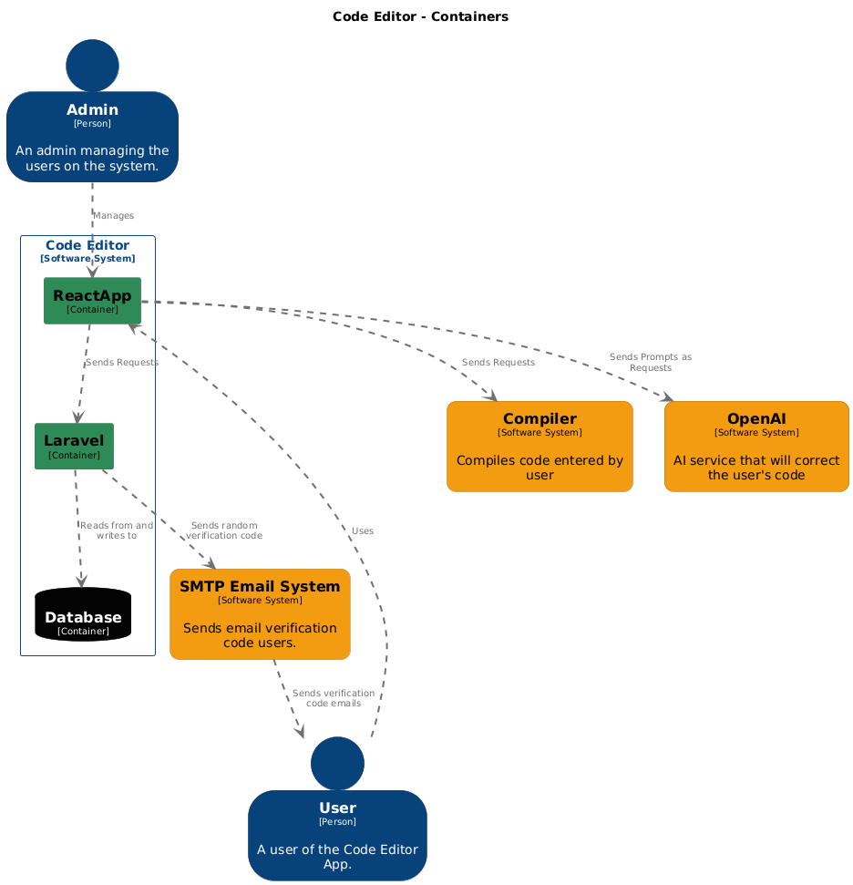

# Pypad

Pypad is an online code editor and a web application that integrates a Laravel 10 backend, a React frontend, and an OpenAI service app. The project consists of three main components, each housed in its own submodule within the repository. Additionally, the project utilizes Redux for state management in the frontend and includes C4 model diagrams to illustrate the system architecture.

## Project Structure

The repository contains the following submodules:

- `pypad-back-end`: The Laravel 10 backend application.
- `pypad-front-end`: The React frontend application.
- `openai-service`: A Node.js application that handles OpenAI API requests.

Additionally, the repository includes a folder named `c4` which contains C4 model diagrams (Level 1 and Level 2).

## Setup Instructions

### Cloning the Repository

To clone the repository with all its submodules, use the following command:

```sh
git clone --recurse-submodules https://github.com/amir-hilal/pypad.git
```

### Backend (Laravel 10)

1. Navigate to the backend directory:

```sh
cd pypad-back-end
```

2. Install dependencies:

```sh
composer install
```

3. Copy the example environment file and modify it according to your setup:

```sh
cp .env.example .env
```

4. Generate an application key:

```sh
php artisan key:generate
```

5. Run the database migrations:

```sh
php artisan migrate --seed
```

6. Start the development server:

```sh
php artisan serve
```

### Frontend (React)

1. Navigate to the frontend directory:

```sh
cd pypad-front-end
```

2. Install dependencies:

```sh
npm install
```

3. Install the latest version of npm globally:

```sh
npm install npm@latest -g
```

4. Start the development server:

```sh
npm start
```

### OpenAI Service App (Node.js)

1. Navigate to the OpenAI service app directory:

```sh
cd openai-service
```

2. Install dependencies:

```sh
npm install
```

3. Copy the example environment file and modify it with your OpenAI API key:

```sh
cp .env.example .env
```

4. Start the server:

```sh
npm start
```

## API Documentation

The API endpoints are documented using Postman. You can view the full documentation [here](https://documenter.getpostman.com/view/24751453/2sA3kYjzyW#22503bba-7791-4548-992d-53b0650feb8d).

## C4 Model Diagrams

The repository includes C4 model diagrams to illustrate the system architecture. The diagrams are located in the `c4` folder and include:

- `pypad-c4model-level1.png`: Level 1 Context Diagram
  
- `pypad-c4model-level2.png`: Level 2 Container Diagram
  

